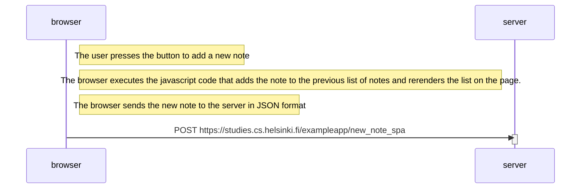

# Exercise 0.6

```mermaid
    sequenceDiagram
        participant browser
        participant server

        Note right of browser: The user presses the button to add a new note
        
        Note right of browser: The browser executes the javascript code that adds the note to the previous list of notes and rerenders the list on the page.
        
        Note right of browser: The browser sends the new note to the server in JSON format

        browser->>server: POST https://studies.cs.helsinki.fi/exampleapp/new_note_spa
        activate server
        deactivate server
```

